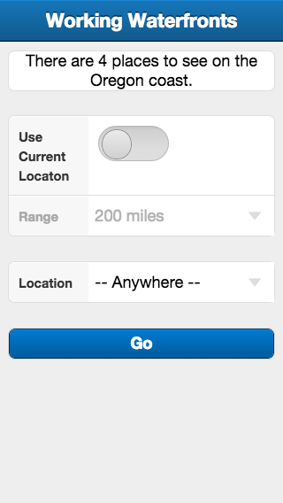

===============================================================================
Getting Started
===============================================================================

.. toctree::
   :maxdepth: 2

This is the first screen displayed by the app.

- Select whether or not locations should be filtered by distance.
- Select how far away locations may be.
- Select from which city locations may be.

Home Screen Layout
===============================================================================

Search Options
===============================================================================

Change these options to find specific or nearby locations.

Use Current Location
-------------------------------------------------------------------------------

Tap or slide the toggle switch to enable location-based searching.

Range
-------------------------------------------------------------------------------

Tap on the dropdown, and use the scroller to select a maximum distance.
Locations beyond this distance will be hidden from the results.

Location
-------------------------------------------------------------------------------

Tap on the dropdown, and use the scroller to select a city.

Only locations within this city will be shown. All other locations will be hidden.

