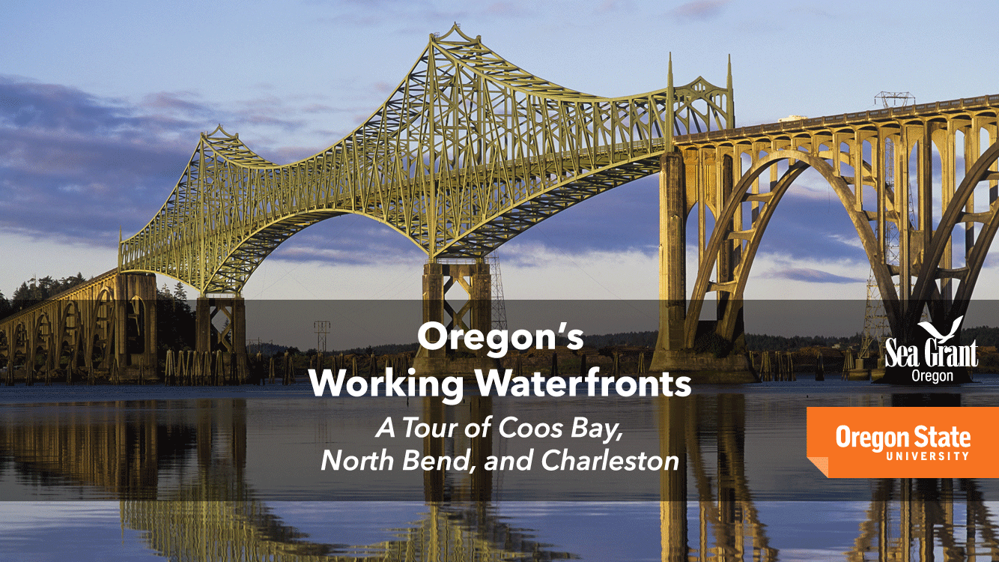

===============================================================================
User Documentation and Help
===============================================================================

*Working Waterfronts Mobile* is a phone and tablet app for finding visitor-friendly work sites along the Oregon coast.

.. toctree::
   :maxdepth: 2

   home.rst
   map.rst
   info.rst

Created by `Oregon Sea Grant`_ and Oregon State University `Center for Applied Systems and Software`_.

.. _Oregon Sea Grant: http://seagrant.oregonstate.edu/
.. _Center for Applied Systems and Software: http://cass.oregonstate.edu/
